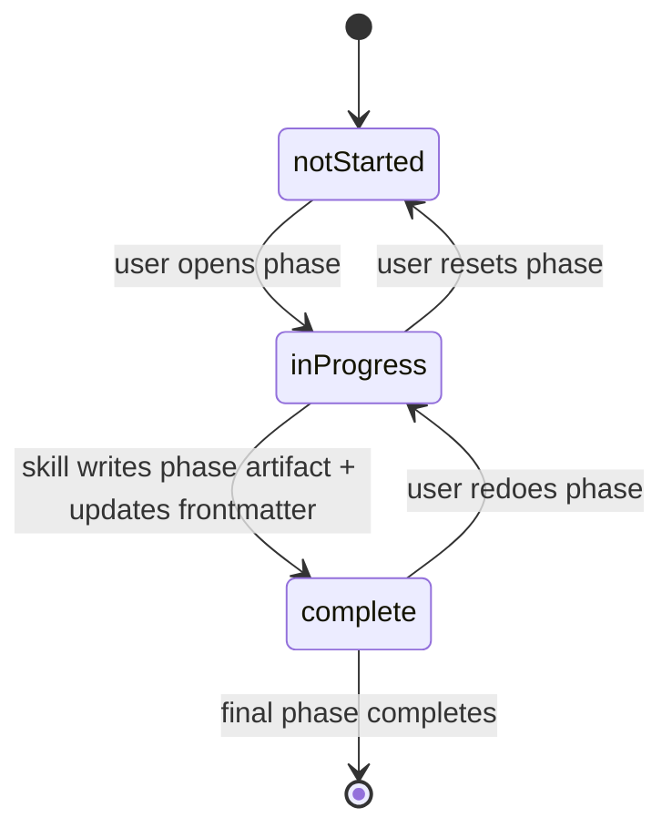
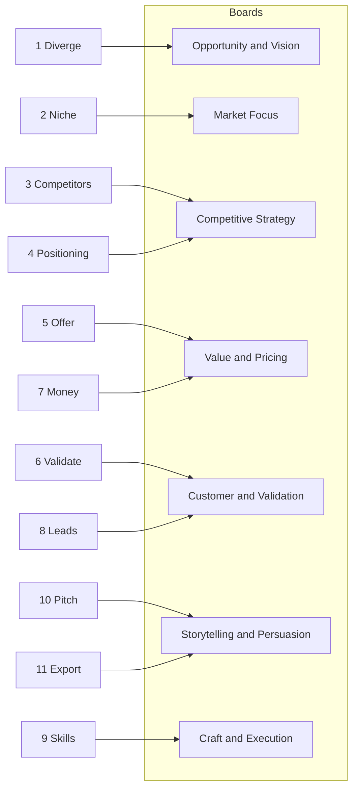

# StartupKit

**A deterministic, phase-sequenced founder-board orchestrator for Claude Code business ideation.**

Node 18+ · MIT License · Claude Code skills · Session-state in YAML frontmatter · Repo-contract-enforced

Why StartupKit · Phases · Architecture · Install · Contracts · CLI · Non-goals

---

## What it is

StartupKit is an **installable, contract-enforced, reality-grounded ideation pipeline** for Claude Code. It decomposes the business-ideation problem into a bounded sequence of 11 phases — _diverge → niche → competitors → positioning → offer → validate → money → leads → skills → pitch → export_ — each implemented as a Claude Code skill with its own prompt, required output sections, and session artifacts. A thin Node CLI ([bin/cli.js](bin/cli.js)) deterministically installs the skills and shared templates under `~/.claude/skills/`, writes a content-hashed install manifest, and classifies every subsequent file transition as `added` / `updated` / `skipped` / `conflict` / `unchanged`. Session state lives as **YAML frontmatter** inside `00-session.md`, so progress is a machine-readable artifact rather than a prose log. Every installable asset is declared in [`.install-contract.json`](.install-contract.json) and constrained by [CONTRACTS.md](CONTRACTS.md), enforced in CI via [`.github/workflows/ci.yml`](.github/workflows/ci.yml). No API keys, no telemetry, no background agents.

---

## Why use StartupKit

- **Structured ideation over open-ended prompting.** An 11-phase pipeline enforces a discipline of diverge → converge → validate → monetize → pitch, backed by one skill per phase in [skills/](skills/). You never start from a blank prompt.
- **Collective founder counsel, not name-dropping.** Seven Domain Expert Boards convene per phase (primary + secondary) via the mapping in [skills/startupkit/SKILL.md](skills/startupkit/SKILL.md). Every decision point surfaces **agreement, disagreement, and application** instead of quoting one founder.
- **Deterministic installer.** [bin/cli.js](bin/cli.js) uses SHA-256 content hashes and an install manifest at `~/.claude/skills/startupkit/.install-manifest.json` to classify every file transition; locally edited files surface as `conflict` and require `--force` to overwrite.
- **Machine-readable session state.** `00-session.md` begins with YAML frontmatter (`session`, `phases`, `export`, `goldNiche`) defined in [templates/session-template.md](templates/session-template.md). Dashboards and phase advancement read from structured data, not prose regex.
- **Single source of truth.** [CONTRACTS.md](CONTRACTS.md) declares the canonical asset layout (`skills/<name>/SKILL.md`, `skills/<name>/references/*.md`, `templates/*.md`). Duplicate mirrors (for example `.claude/skills/`) are explicitly forbidden.
- **Reference-by-design.** Heavy phases (competitors, positioning, pitch) carry declared **mode contracts** (`quick` / `standard` / `deep`) and **output contracts** under each skill's `references/` directory. Downstream phases consume only the sections a contract declares.
- **Local-only, subscription-driven.** Every LLM call is a Claude Code session. No API keys, no per-token billing, no outbound telemetry.
- **CI guardrails.** [`.github/workflows/ci.yml`](.github/workflows/ci.yml) runs `node bin/cli.js doctor` plus an install dry-run on every push and pull request.

---

## Design principles

| Principle | Mechanism |
|---|---|
| **One source of truth per asset** | [CONTRACTS.md](CONTRACTS.md) declares canonical locations; [`.install-contract.json`](.install-contract.json) enumerates every shipped asset |
| **Deterministic install, not `cp -r`** | [bin/cli.js](bin/cli.js) hashes every source and destination file and classifies the transition explicitly |
| **Manifest-tracked local edits** | `~/.claude/skills/startupkit/.install-manifest.json` records prior hashes; drift becomes a first-class `conflict` action |
| **Structured session state** | YAML frontmatter in `00-session.md` drives phase status and next-step logic |
| **Phase skills carry their own contracts** | Each heavy skill declares `references/mode-contracts.md` and `references/output-contracts.md` |
| **Fresh-context domain boards** | Seven named boards (see below) are convened per phase with agreement/disagreement/application structure |
| **CI-backed contract enforcement** | The CI workflow runs `doctor` and a dry-run install on every push and pull request |
| **No background agents, no telemetry** | Everything happens inside the user's Claude Code session and the local filesystem |

---

## Phases

`/startupkit` is the orchestrator, not a numbered phase. It creates sessions, renders the dashboard from frontmatter, and routes the user to the next skill.

| # | Phase | Command | Role |
|---|---|---|---|
| 1 | Diverge | `/sk-diverge` | Brainstorm skills, passions, and problems |
| 2 | Niche | `/sk-niche` | Score and rank niche ideas |
| 3 | Competitors | `/sk-competitors` | Analyze competitors and pricing |
| 4 | Positioning | `/sk-positioning` | Build market positioning |
| 5 | Offer | `/sk-offer` | Build a Grand Slam Offer |
| 6 | Validate | `/sk-validate` | Plan interviews, outreach, MVP validation |
| 7 | Money | `/sk-money` | Build pricing and revenue model |
| 8 | Leads | `/sk-leads` | Design lead channels and nurture strategy |
| 9 | Skills | `/sk-skills` | Map AI skill opportunities to the offer |
| 10 | Pitch | `/sk-pitch` | Build investor pitch materials |
| 11 | Export | `/sk-export` | Generate final one-pager |

---

## How a session flows

```text
1. /startupkit      → create session, render dashboard from frontmatter
2. /sk-diverge      → raw idea surface (no judging)
3. /sk-niche        → converge via Taki Moore 3Q + Hormozi 4-criteria
4. /sk-competitors  → research, mode=quick|standard|deep
5. /sk-positioning  → Dunford 5+1, mode-contracted output
6. /sk-offer        → Grand Slam Offer (Six P's + Value Equation)
7. /sk-validate     → discovery calls, outreach, MVP plan
8. /sk-money        → pricing, offer ladder, projections
9. /sk-leads        → channels + nurture sequence
10. /sk-skills      → AI skill integration plan
11. /sk-pitch       → investor pitch materials (mode-contracted)
12. /sk-export      → one-pager summary
```

At every step, the active skill writes back into `00-session.md` frontmatter (`phases[id=N].status`, `session.activePhase`, `session.nextPhase`, `session.updated`) as defined in [skills/startupkit/references/session-state-protocol.md](skills/startupkit/references/session-state-protocol.md).

---

## Session state machine



Each of the 11 phases is a row in `phases[]`. `session.activePhase` tracks the currently focused phase; `session.nextPhase` is the recommended next command.

---

## Architecture

```mermaid
flowchart TB
    subgraph Repo [Repository]
        skillsDir[skills/]
        templatesDir[templates/]
        contractJson[".install-contract.json"]
        contractsMd[CONTRACTS.md]
    end

    subgraph CLI [bin/cli.js]
        init[init --upgrade --force --dry-run --verbose]
        doctor[doctor]
        uninstall[uninstall]
    end

    subgraph Home [~/.claude/skills]
        installedSkills["<skill>/SKILL.md + references/"]
        installedTemplates["startupkit/templates/*.md"]
        manifest[".install-manifest.json"]
    end

    subgraph Session [workspace/sessions/{name}]
        sessionMd["00-session.md (YAML frontmatter)"]
        phaseArtifacts["01-..11-*.md artifacts"]
    end

    Repo --> CLI
    CLI --> Home
    Home --> Session
    contractsMd --> CLI
    contractJson --> CLI
```

- **Serial by construction.** One phase at a time. No background daemons, no multi-agent parallelism.
- **Install target is stable.** Skills always land in `~/.claude/skills/<skill>/`. Shared templates always land in `~/.claude/skills/startupkit/templates/`.

---

## Domain Expert Boards

Seven boards, mapped per phase. Each skill convenes its **primary** board and consults its **secondary** board.



The full primary/secondary mapping lives in [skills/startupkit/SKILL.md](skills/startupkit/SKILL.md).

---

## Observability

Everything is on disk, in a form you can grep, diff, and replay.

```text
workspace/sessions/{name}/
├── 00-session.md          # YAML frontmatter + progress tracker (source of truth)
├── 01-diverge.md          # Raw idea surface
├── 02-niches.md           # Scored niches + Gold selection
├── 03-competitors.md      # Competitive summary
├── 03-competitors/        # Full deliverables (battle cards, pricing, matrix)
├── 04-positioning.md      # Positioning summary
├── 04-positioning/        # Full deliverables (statements, alternatives, messaging)
├── 05-offer.md            # Grand Slam Offer
├── 06-validation.md       # Validation plan
├── 07-money-model.md      # Pricing, offer ladder, projections
├── 08-lead-strategy.md    # Channels + nurture
├── 09-skills-match.md     # AI skill recommendations
├── 10-pitch.md            # Investor pitch summary + scorecard
├── 10-pitch/              # Full pitch deliverables
└── 11-one-pager.md        # Final one-pager export
```

`00-session.md` is authoritative for phase status. The orchestrator renders the dashboard from its frontmatter.

---

## Install

Two equal paths. Both leave the same result on disk: skills under `~/.claude/skills/`, shared templates under `~/.claude/skills/startupkit/templates/`, and an install manifest alongside.

### Option A — npm CLI

```bash
npx startup-ideation-kit init
```

The package is `startup-ideation-kit`; the binary is `startupkit`. Once available on your `PATH`:

```bash
startupkit init
startupkit init --upgrade
startupkit init --dry-run --upgrade
startupkit uninstall
```

### Option B — skill registry

```bash
npx skills add mohamedameen-io/StartupKit
```

---

## Installer behavior

On `init`, every source file is classified against the install manifest and the current destination:

| Action | Meaning |
|---|---|
| `added` | destination did not exist |
| `updated` | source differed, applied under `--upgrade` or `--force` |
| `skipped` | source and destination identical, or `--upgrade` / `--force` not set |
| `conflict` | destination differs from manifest (local edits); requires `--force` |
| `unchanged` | identical under `--upgrade` |

Flags:

| Flag | Effect |
|---|---|
| `--upgrade` | Apply changes where source differs, preserving local edits as `conflict` |
| `--force` | Overwrite even on `conflict` |
| `--dry-run` | Classify without writing |
| `--verbose` | Print per-file decisions including `unchanged` |

A report is printed at the end of every run summarizing totals per action.

---

## Session output

Session files are written under the current working directory: `workspace/sessions/{name}/`. Each phase skill updates the frontmatter in `00-session.md` after its save step. The export skill sets `export.generated: true` and updates `session.status`.

---

## Contracts

StartupKit treats the repository layout as a contract, not a convention.

- **Canonical sources** — declared in [CONTRACTS.md](CONTRACTS.md):
  - `skills/<name>/SKILL.md`
  - `skills/<name>/references/*.md`
  - `templates/*.md`
- **Enumerated assets** — [`.install-contract.json`](.install-contract.json) lists every shipped skill and template; CI fails if filesystem and contract drift.
- **Forbidden mirrors** — tracking duplicate skill content under `.claude/` or other mirror directories is disallowed.
- **No absolute local paths** — absolute host paths (for example `/Users/...`) are forbidden inside any `SKILL.md`.

---

## CLI reference

| Command | Purpose |
|---|---|
| `startupkit init` | Install skills and shared templates under `~/.claude/skills/` |
| `startupkit init --upgrade` | Apply changed source files, preserving local edits as `conflict` |
| `startupkit init --force` | Overwrite local edits during upgrade |
| `startupkit init --dry-run` | Classify transitions without writing |
| `startupkit init --verbose` | Include `unchanged` entries in the per-file log |
| `startupkit doctor` | Run repository contract checks (script under [scripts/doctor/](scripts/doctor/)) |
| `startupkit uninstall` | Remove installed skills, templates, and manifest |
| `startupkit help` | Print usage |

Commands not in this table are not implemented in [bin/cli.js](bin/cli.js).

---

## Doctor and CI

- **doctor** is wired in [bin/cli.js](bin/cli.js) and dispatches to `scripts/doctor/index.js`; it runs repository contract checks against [CONTRACTS.md](CONTRACTS.md) and [`.install-contract.json`](.install-contract.json).
- **CI** is defined in [`.github/workflows/ci.yml`](.github/workflows/ci.yml). On every push and pull request, it runs:
  - `npm ci`
  - `node bin/cli.js doctor`
  - `node bin/cli.js init --dry-run --upgrade` under a temporary `$HOME`

This is the same `doctor` the local CLI runs — CI has no parallel implementation to drift from.

---

## How it compares

| Capability | StartupKit | Single-chat ideation | Generic template pack |
|---|---|---|---|
| 11-phase pipeline with named skills | Yes (phases 1–11) | No | Partial |
| Machine-readable session state | Yes (YAML frontmatter) | No | No |
| Deterministic installer with manifest | Yes (SHA-256 + action classes) | N/A | No |
| Conflict-aware upgrade | Yes (`--upgrade` / `--force`) | N/A | No |
| Contract-enforced asset layout | Yes ([CONTRACTS.md](CONTRACTS.md), [`.install-contract.json`](.install-contract.json)) | No | No |
| Mode contracts for heavy phases | Yes (`quick` / `standard` / `deep`) | No | No |
| CI-enforced contract checks | Yes ([`.github/workflows/ci.yml`](.github/workflows/ci.yml)) | No | No |
| Local-only, no API keys | Yes | Depends | Yes |
| No telemetry | Yes | Depends | Yes |

---

## Non-goals

StartupKit intentionally does **not** do these things:

- **No background agents.** Phases are serial and user-driven. Nothing runs on a daemon.
- **No in-context delegation.** Skills do not `@mention` each other mid-conversation.
- **No hidden CLI surface.** If it is not in the CLI reference above, it is not implemented. Commands like `founders search` do not exist.
- **No API keys.** StartupKit depends on your Claude Code session, not direct LLM APIs.
- **No telemetry.** Nothing phones home. All state lives under `workspace/` and `~/.claude/skills/`.
- **No duplicate mirrors.** `.claude/skills/` and other install mirrors are not tracked; [CONTRACTS.md](CONTRACTS.md) forbids them.
- **No silent overwrites.** Locally modified installed files surface as `conflict` until you pass `--force`.

---

## Project structure

```text
StartupKit/
  bin/                        # Node CLI entrypoint (startupkit)
  skills/                     # Skill definitions and per-skill references
  templates/                  # Canonical shared templates
  scripts/doctor/             # Repository contract checks
  docs/                       # Register / evidence / project docs
  workspace/sessions/         # Session outputs (local)
  .install-contract.json      # Enumerated installable assets
  CONTRACTS.md                # Source-of-truth path contract
  .github/workflows/ci.yml    # doctor + install dry-run on push/PR
```

---

## Requirements

- [Claude Code](https://claude.ai/code)
- Node.js 18+ (for both `npx skills add ...` and `npx startup-ideation-kit ...`)

---

## Attribution

Frameworks used across phases draw from Alex Hormozi, April Dunford, Taki Moore, Geoffrey Moore, Marty Neumeier, Ali Abdaal, Rob Fitzpatrick, and the founder-biography corpus that informs the Domain Expert Boards. All credit for the underlying business frameworks goes to their respective creators.

## License

MIT License. See [LICENSE](LICENSE).
